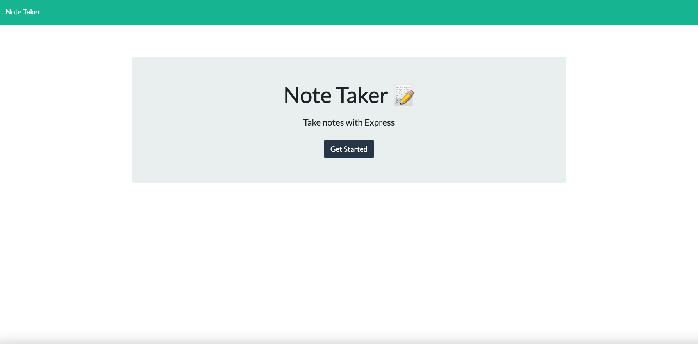
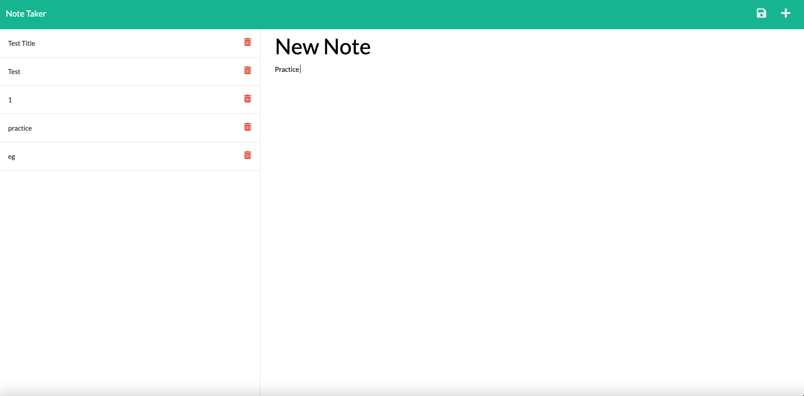

# note-taker

## Description

As a small business owner, I want to be able to write and save notes so that I can keep track of tasks I need to complete and organize my thoughts.

## Table of content

* [Preview](#preview)
* [Installation](#installation)
* [Usage](#usage)
* [Features](#features)
* [Credits](#credits)
* [License](#license)
* [Badge](#badge)
* [Contributing](#contributing)

[Deployed application](https://note-taker-app27.herokuapp.com/)

[Github Repository](https://github.com/kingopara/NoteTaker)

## Preview

## Installation

* Clone this repository into your local machine
* Install dependencies using 
1. npm init -y
2. npm install express

## Usage

* invoke/start the local host with any of these commands

1. node server. js
2. npm start

* navigate to the browser and open http://localhost:3009 to run the app

## Features

1. Express.json to build back-end server
2. db.json file used the fs module to store & retrieve data
3. connected front-end to back-end
4. App deployed to heroku

## Credit

Made by Praise Opara with assistance from UT Austing Coding Bootcamp

## License

[MIT](https://opensource.org/licenses/MIT)

## Badge

[badmath](https://img.shields.io/github/languages/top/nielsenjared/badmath)

## Contributing

